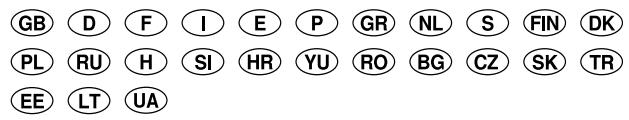
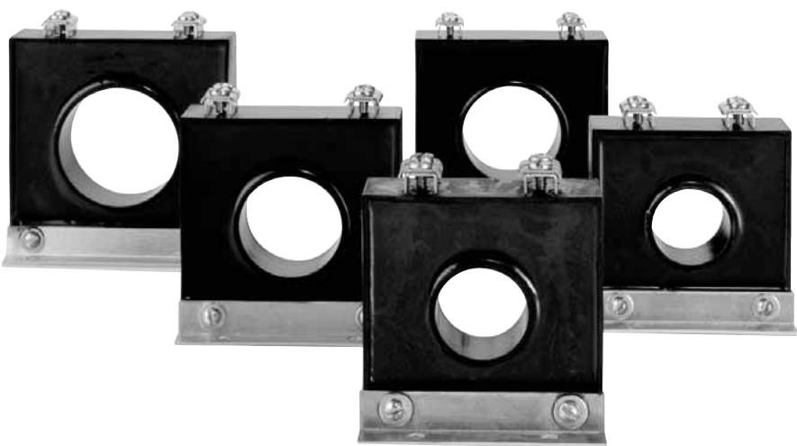
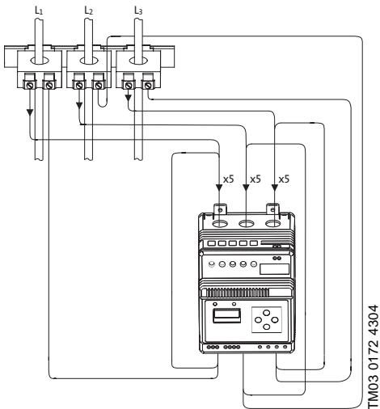
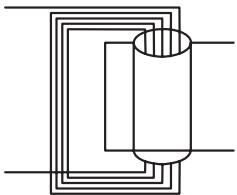
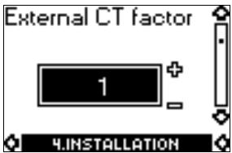
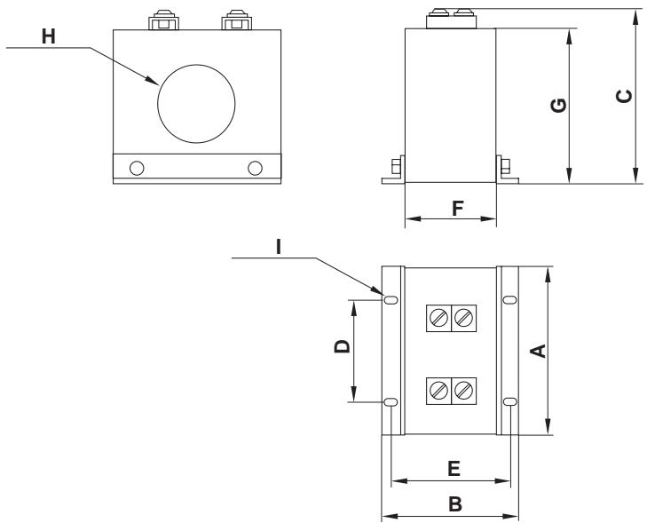

## Current transformer

MP 204 accessory

Installation and operating instructions

## Current transformer

## MP 204 accessory

Installation and operating instructions 4 GB   
Montage- und Betriebsanleitung 6 D   
Notice d’installation et d’entretien 8 F   
Istruzioni di installazione e funzionamento 10 I   
Instrucciones de instalación y funcionamiento 12 E   
Instruções de instalação e funcionamento 14 P   
Οδηγίες εγκατάστασης και λειτουργίας 16 GR   
Installatie- en bedieningsinstructies 18 NL   
Monterings- och driftsinstruktion 20 S   
Asennus- ja käyttöohjeet 22 FIN   
Monterings- og driftsinstruktion 24 DK   
Instrukcja montażu i eksploatacji 26 PL   
Руководство по монтажу и эксплуатации 28 RU   
Szerelési és üzemeltetési utasítás 30 H   
Navodilo za montažo in obratovanje 32 Sl   
Montažne i pogonske upute 34 HR   
Uputstvo za montažu i upotrebu 36 YU   
Instrucţiuni de instalare şi utilizare 38 RO   
Упътване за монтаж и експлоатация 40 BG   
Montážní a provozní návod 42 CZ   
Návod na montáž a prevádzku 44 SK   
Montaj ve kullanım kılavuzu 46 TR   
Paigaldus- ja kasutusjuhend 48 EE   
Montavimo ir eksploatacijos instrukcija 50 LT   
Інструкції з монтажу та експлуатації 52 UA

<table><tr><td colspan="2">Page 4</td></tr><tr><td>1.</td><td>General information</td></tr><tr><td>2. Product range</td><td>4</td></tr><tr><td>3. Mounting</td><td>4</td></tr><tr><td>4. Connection</td><td>4</td></tr><tr><td>4.1 MP 204 setup</td><td>4</td></tr><tr><td>5. Maintenance</td><td>5</td></tr><tr><td>6. Disposal</td><td>5</td></tr></table>

Prior to installation, read these installation and operating instructions. Installation and operation must comply with local regulations and accepted codes of good practice.

## 1. General information

The current transformers are accessories for the Grundfos MP 204 motor protector.

At motor currents above 120 A and up to and including 1000 A, current transformers must be used.

## 2. Product range

<table><tr><td>Product number</td><td>Current trans- former ratio</td><td>Imax.</td><td>Pmax.</td></tr><tr><td>96095274</td><td>200:5</td><td>200 A</td><td>5 VA</td></tr><tr><td>96095275</td><td>300:5</td><td>300 A</td><td>5 VA</td></tr><tr><td>96095276</td><td>500:5</td><td>500 A</td><td>5 VA</td></tr><tr><td>96095277</td><td>750:5</td><td>750 A</td><td>5 VA</td></tr><tr><td>96095278</td><td>1000:5</td><td>1000 A</td><td>5 VA</td></tr></table>

## 3. Mounting

Fit the current transformers to a metal plate with four screws so that the cables to the motor can easily be taken through the transformers. See dimensional sketch on page 54.

Note: The current transformers must be fitted in the same direction.

## 4. Connection

For a three-phase installation, three current transformers must be used.

Take each phase to the motor through a current transformer, see fig. 1.

Connect the secondary side of each current transformer to a wire and take the wire five times through the I1, I2 and I3 of the MP 204, see figs. 1 and 2.

Note: The three current transformers must be fitted in the same direction and connected in the same way.

  
Fig. 1 Connection

  
Fig. 2 Five windings through the MP 204

## 4.1 MP 204 setup

When the current transformers are used together with an MP 204 and the installation is made as shown in figs. 1 and 2, the actual current transformer factor must be set in the MP 204 with the Grundfos R100 remote control. See table on page 54. Set the current transformer factor in menu INSTALLATION, see fig. 3.

  
Fig. 3 R100 display

For further settings, see installation and operating instructions for the MP 204.

This product or parts of it must be disposed of in an environmentally sound way:

1. Use the public or private waste collection service.

2. If this is not possible, contact the nearest Grund fos company or service workshop.

<table><tr><td>Type</td><td>A</td><td>B</td><td>C</td><td>D</td><td>E</td><td>F</td><td>G</td><td>H ID</td><td>1 ID</td><td>MP 204 CT factor</td></tr><tr><td rowspan="2">200:5</td><td>71.4</td><td>50.8</td><td>77.7</td><td>34.0</td><td>38.1</td><td>25.4</td><td>71.4</td><td>26.9</td><td>4.6</td><td rowspan="2">8</td></tr><tr><td>2.81</td><td>2.00</td><td>3.06</td><td>1.34</td><td>1.50</td><td>1.00</td><td>2.81</td><td>1.06</td></tr><tr><td rowspan="2">300:5</td><td>71.4</td><td>50.8</td><td>77.7</td><td>34.0</td><td>38.1</td><td>25.4</td><td>71.4</td><td>26.9</td><td>0.18 4.6</td><td rowspan="2">12</td></tr><tr><td>2.81</td><td>2.00</td><td>3.06</td><td>1.34</td><td>1.50</td><td>1.00</td><td>2.81</td><td>1.06</td><td>0.18</td></tr><tr><td rowspan="2">500:5</td><td>79.2</td><td>50.8</td><td>85.3</td><td>36.8</td><td>38.1</td><td>25.4</td><td>79.2</td><td>34.8</td><td>4.6</td><td rowspan="2">20</td></tr><tr><td>3.12</td><td>2.00</td><td>3.36</td><td>1.45</td><td>1.50</td><td>1.00</td><td>3.12</td><td>1.37</td><td>0.18</td></tr><tr><td rowspan="2">750:5</td><td>90.7</td><td>50.8</td><td>91.7</td><td>50.8</td><td>38.1</td><td>25.4</td><td>85.6</td><td>41.1</td><td>4.6</td><td rowspan="2">30</td></tr><tr><td>3.57</td><td>2.00</td><td>3.61</td><td>2.00</td><td>1.50</td><td>1.00</td><td>3.37</td><td>1.62</td><td>0.18</td></tr><tr><td rowspan="2">1000:5</td><td>91.9</td><td>50.8</td><td>98.0</td><td>50.8</td><td>38.1</td><td>25.4</td><td>91.9</td><td>47.5</td><td>4.6</td><td rowspan="2">40</td></tr><tr><td>3.62</td><td>2.00</td><td>3.86</td><td>2.00</td><td>1.50</td><td>1.00</td><td>3.62</td><td>1.87</td><td>0.18</td></tr></table>

Measurements in bold are inches.

## Denmark

GRUNDFOS DK A/S Martin Bachs Vej 3 DK-8850 Bjerringbro Tlf.: +45-87 50 50 50 Telefax: +45-87 50 51 51 E-mail: info\_GDK@grundfos.com www.grundfos.com/DK

## Argentina

Bombas GRUNDFOS de Argentina S.A.   
Ruta Panamericana km. 37.500 Lote 34A   
1619 - Garin   
Pcia. de Buenos Aires   
Phone: +54-3327 414 444   
Telefax: +54-3327 411 111

## Australia

GRUNDFOS Pumps Pty. Ltd. P.O. Box 2040   
Regency Park   
South Australia 5942   
Phone: +61-8-8461-4611   
Telefax: +61-8-8340 0155

## Austria

GRUNDFOS Pumpen Vertrieb Ges.m.b.H.   
Grundfosstraße 2   
A-5082 Grödig/Salzburg   
Tel.: +43-6246-883-0   
Telefax: +43-6246-883-30

## Belgium

N.V. GRUNDFOS Bellux S.A. Boomsesteenweg 81-83 B-2630 Aartselaar Tél.: +32-3-870 7300 Télécopie: +32-3-870 7301

## Belorussia

Представительство ГРУНДФОС в Минске 220090 Минск ул.Олешева 14 Телефон: (8632) 62-40-49 Факс: (8632) 62-40-49

## Bosnia/Herzegovina

GRUNDFOS Sarajevo Paromlinska br. 16, BiH-71000 Sarajevo Phone: +387 33 713290 Telefax: +387 33 231795

## Brazil

GRUNDFOS do Brasil Ltda. Rua Tomazina 106   
CEP 83325 - 040   
Pinhais - PR   
Phone: +55-41 668 3555 Telefax: +55-41 668 3554

## Bulgaria

GRUNDFOS Pumpen Vertrieb Representative Office - Bulgaria Bulgaria, 1421 Sofia   
Lozenetz District   
105-107 Arsenalski blvd.   
Phone: +359 2963 3820, 2963 5653   
Telefax: +359 2963 1305

## Canada

GRUNDFOS Canada Inc. 2941 Brighton Road Oakville, Ontario L6H 6C9 Phone: +1-905 829 9533 Telefax: +1-905 829 9512

## China

GRUNDFOS Pumps (Shanghai) Co. Ltd.   
22 Floor, Xin Hua Lian Building 755-775 Huai Hai Rd, (M)   
Shanghai 200020   
PRC   
Phone: +86-512-67 61 11 80 Telefax: +86-512-67 61 81 67

## Croatia

GRUNDFOS predstavništvo   
Zagreb   
Cebini 37, Buzin   
HR-10000 Zagreb   
Phone: +385 1 6595 400   
Telefax: +385 1 6595 499

## Czech Republic

GRUNDFOS s.r.o.   
Čapkovského 21   
779 00 Olomouc   
Phone: +420-585-716 111 Telefax: +420-585-716 299

## Estonia

GRUNDFOS Pumps Eesti OÜ   
Peterburi tee 44   
11415 Tallinn   
Tel: + 372 606 1690   
Fax: + 372 606 1691

## Finland

OY GRUNDFOS Pumput AB   
Mestarintie 11   
Piispankylä   
FIN-01730 Vantaa (Helsinki)   
Phone: +358-9 878 9150   
Telefax: +358-9 878 91550

## France

Pompes GRUNDFOS Distribution S.A.   
Parc d’Activités de Chesnes 57, rue de Malacombe   
F-38290 St. Quentin Fallavier (Lyon)   
Tél.: +33-4 74 82 15 15   
Télécopie: +33-4 74 94 10 51

## Germany

## Greece

GRUNDFOS Hellas A.E.B.E. 20th km. Athinon-Markopoulou Av.   
P.O. Box 71   
GR-19002 Peania   
Phone: +0030-210-66 83 400 Telefax: +0030-210-66 46 273

## Hong Kong

GRUNDFOS Pumps (Hong   
Kong) Ltd.   
Unit 1, Ground floor   
Siu Wai Industrial Centre   
29-33 Wing Hong Street &   
68 King Lam Street, Cheung Sha Wan

Phone: +852-27861706 / 27861741 Telefax: +852-27858664

## Hungary

GRUNDFOS Hungária Kft. Park u. 8 H-2045 Törökbálint, Phone: +36-23 511 110 Telefax: +36-23 511 111

## India

GRUNDFOS Pumps India Pri  
vate Limited   
118 Old Mahabalipuram Road   
Thoraipakkam   
Chamiers Road   
Chennai 600 096   
Phone: +91-44 2496 6800

## Indonesia

## Ireland

GRUNDFOS (Ireland) Ltd. Unit A, Merrywell Business Park Ballymount Road Lower Dublin 12 Phone: +353-1-4089 800 Telefax: +353-1-4089 830

## Italy

GRUNDFOS Pompe Italia S.r.l. Via Gran Sasso 4   
I-20060 Truccazzano (Milano) Tel.: +39-02-95838112   
Telefax: +39-02-95309290 /   
95838461

## Japan

GRUNDFOS Pumps K.K. 1-2-3, Shin Miyakoda Hamamatsu City Shizuoka pref. 431-21 Phone: +81-53-428 4760 Telefax: +81-53-484 1014

## Korea

GRUNDFOS Pumps Korea Ltd. 6th Floor, Aju Building 679-5 Yeoksam-dong, Kangnam-ku, 135-916   
Seoul, Korea   
Phone: +82-2-5317 600   
Telefax: +82-2-5633 725

## Latvia

SIA GRUNDFOS Pumps Latvia Deglava biznesa centrs Augusta Deglava ielā 60, LV-1035, Rīga, Tālr.: + 371 714 9640, 7 149 641 Fakss: + 371 914 9646

## Lithuania

GRUNDFOS Pumps UAB Smolensko g. 6 LT-03201 Vilnius Tel: + 370 52 395 430 Fax: + 370 52 395 431

## Malaysia

GRUNDFOS Pumps Sdn. Bhd. 7 Jalan Peguam U1/25   
Glenmarie Industrial Park   
40150 Shah Alam   
Selangor   
Phone: +60-3-5569 2922   
Telefax: +60-3-5569 2866

## Mexico

Bombas GRUNDFOS de Mexico S.A. de C.V.   
Boulevard TLC No. 15   
Parque Industrial Stiva Aeropuerto   
Apodaca, N.L. 66600   
Mexico   
Phone: +52-81-8144 4000   
Telefax: +52-81-8144 4010

## Netherlands

GRUNDFOS Nederland B.V. Postbus 104   
NL-1380 AC Weesp   
Tel.: +31-294-492 211   
Telefax: +31-294-492244/ 492299

## New Zealand

GRUNDFOS Pumps NZ Ltd. 17 Beatrice Tinsley Crescent North Harbour Industrial Estate Albany, Auckland Phone: +64-9-415 3240 Telefax: +64-9-415 3250

## Norway

GRUNDFOS Pumper A/S Strømsveien 344 Postboks 235, Leirda N-1011 Oslo Tlf.: +47-22 90 47 00 Telefax: +47-22 32 21 50

## Poland

GRUNDFOS Pompy Sp. z o.o. ul. Klonowa 23 Baranowo k. Poznania PL-62-081 Przeźmierowo Phone: (+48-61) 650 13 00 Telefax: (+48-61) 650 13 50

## Portugal

Bombas GRUNDFOS Portugal, S.A.   
Rua Calvet de Magalhães, 241 Apartado 1079   
P-2770-153 Paço de Arcos   
Tel.: +351-21-440 76 00   
Telefax: +351-21-440 76 90

## România

## Russia

ООО Грундфос   
Россия, 109544 Москва,   
Школьная 39   
Тел. (+7) 095 737 30 00, 564 88   
00   
Факс (+7) 095 737 75 36, 564   
88 11   
E-mail   
grundfos.moscow@grundfos.co   
m

## Serbia and Montenegro

GRUNDFOS Predstavništvo   
Beograd   
Dr. Milutina Ivkovića 2a/29   
YU-11000 Beograd   
Phone: +381 11 26 47 877 / 11   
26 47 496   
Telefax: +381 11 26 48 340

## Singapore

GRUNDFOS (Singapore) Pte. Ltd.   
24 Tuas West Road   
Jurong Town   
Singapore 638381   
Phone: +65-6865 1222   
Telefax: +65-6861 8402

## Slovenia

GRUNDFOS PUMPEN VER-TRIEB Ges.m.b.H., Podružnica Ljubljana Blatnica 1, SI-1236 Trzin Phone: +386 1 563 5338 Telefax: +386 1 563 2098 E-mail: slovenia@grundfos.si

## Spain

Bombas GRUNDFOS España S.A. Camino de la Fuentecilla, s/n E-28110 Algete (Madrid) Tel.: +34-91-848 8800 Telefax: +34-91-628 0465

## Sweden

GRUNDFOS AB   
Lunnagårdsgatan 6   
431 90 Mölndal   
Tel.: +46-0771-32 23 00   
Telefax: +46-31 331 94 60

## Switzerland

GRUNDFOS Pumpen AG Bruggacherstrasse 10 CH-8117 Fällanden/ZH Tel.: +41-1-806 8111 Telefax: +41-1-806 8115

## Taiwan

GRUNDFOS Pumps (Taiwan) Ltd.

7 Floor, 219 Min-Chuan Road Taichung, Taiwan, R.O.C. Phone: +886-4-2305 0868 Telefax: +886-4-2305 0878

## Thailand

GRUNDFOS (Thailand) Ltd.   
947/168 Moo 12, Bangna-Trad Rd., K.M. 3,   
Bangna, Phrakanong   
Bangkok 10260   
Phone: +66-2-744 1785 ... 91 Telefax: +66-2-744 1775 ... 6

## Turkey

GRUNDFOS POMPA San. ve Tic. Ltd. Sti. Gebze Organize Sanayi Bölgesi Ihsan dede Caddesi, 2. yol 200. Sokak No. 204 41490 Gebze/ Kocael Phone: +90 - 262-679 7979 Telefax: +90 - 262-679 7905 E-mail: satis@grundfos.com

## Ukraine

ТОВ ГРУНДФОС Украина ул. Владимирская, 71, оф. 45 г. Киев, 01033, Украина, Тел. +380 44 289 4050 Факс +380 44 289 4139

## United Arab Emirates

GRUNDFOS Gulf Distribution   
P.O. Box 16768   
Jebel Ali Free Zone   
Dubai   
Phone: +971-4- 8815 166   
Telefax: +971-4-8815 13

## United Kingdom

GRUNDFOS Pumps Ltd.   
Grovebury Road   
Leighton Buzzard/Beds. LU7 8TL   
Phone: +44-1525-850000   
Telefax: +44-1525-850011

## U.S.A.

GRUNDFOS Pumps Corporation 17100 West 118th Terrace Olathe, Kansas 66061 Phone: +1-913-227-3400 Telefax: +1-913-227-3500

## Usbekistan

Представительство   
ГРУНДФОС в Ташкенте   
700000 Ташкент ул.Усмана   
Носира 1-й   
тупик 5   
Телефон: (3712) 55-68-15   
Факс: (3712) 53-36-35